# React + TypeScript + Vite

# 🏥 Hospital Management System
A modern hospital management web application built with React, TailwindCSS, and Material UI — featuring full authentication & role-based authorization. This system allows users to register, log in, manage appointments, and for administrators to take full control over data with advanced CRUD functionality.

# ✨ Features
🔐 Authentication with JSON Web Tokens (JWT)

🧑‍⚕️ Role-based access: differentiate between Admin and Patient

📅 Appointment scheduling and management

✍️ CRUD operations for Doctors, Appointments, Users

⚡ Built with React 19, TailwindCSS, and Material UI

✅ Form validation using React Hook Form + Zod

👮‍♂️ Full client-side route protection based on user role

## 🧪 Demo Credentials
You can try logging in with the following test accounts:

| Role   | Username  | Password |
|--------|-----------|----------|
| Admin  | vergoulis | 12345    |
| Patient| mairh     | 12345    |
| Doctor | willy     | 12345    |

# 1. Clone the repository
git clone 

# 2. Install dependencies
npm install

# 3. Start the development server
npm run dev

# 📦 Dependencies & Purpose

| Package                           | Description                                         |
|-----------------------------------|-----------------------------------------------------|
| `react`, `react-dom`              | Core UI rendering                                   |
| `react-router`                    | Routing and navigation                              |
| `react-hook-form`                 | Modern form handling                                |
| `zod`                             | Schema validation with form integration             |
| `@mui/material`, `icons`, `grid` | Elegant UI components & data grids                  |
| `@emotion/react`, `styled`       | MUI styling system                                  |
| `@fontsource/roboto`             | Roboto font for consistent design                    |
| `axios`                           | API calls and HTTP requests                         |
| `jwt-decode`                      | Decodes JWT tokens for access control               |
| `lucide-react`                    | Iconography (clean, sharp React icons)              |
| `tailwindcss`, `@tailwindcss/vite`| Utility-first CSS styling, integrated with Vite     |
| `react-big-calendar`               |  Calendar & scheduling UI with customizable views  |
| `react- toastify`                  | Toast notification for user feedback and alerts    |
| `vite`                            | Fast dev server and bundler (in devDependencies)    |

🛡️ Authorization Logic
Users are redirected based on authentication status and role.

Admin users gain access to restricted routes such as /admin, /admin-user, and all CRUD operations.

Doctor users have their own login and are redirected to a dedicated dashboard. They can view and manage their own appointments

Non-authenticated users cannot access protected pages and are redirected to /login.

This role-based access ensures that each user only interacts with the parts of the system relevant to their responsibilities

## 📸 Screenshots

### 🔐 Home 1
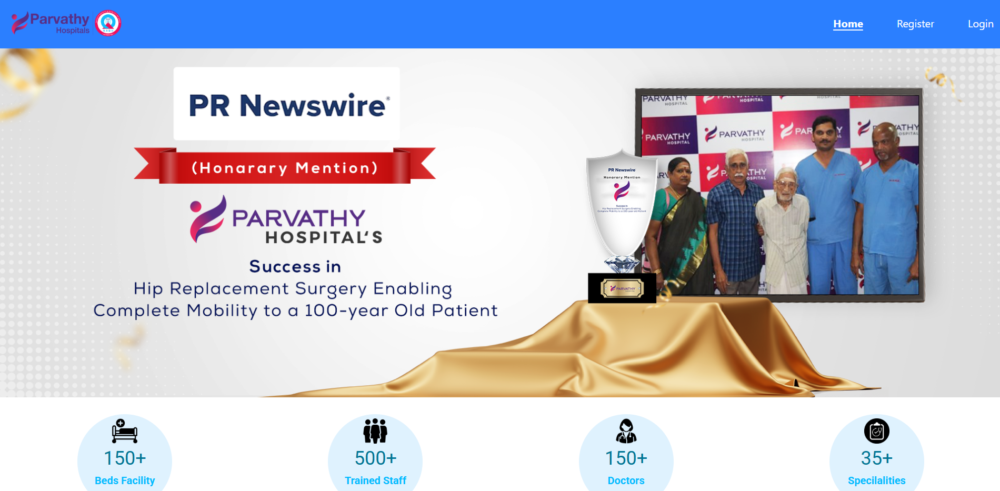

### 🔐 Home 2
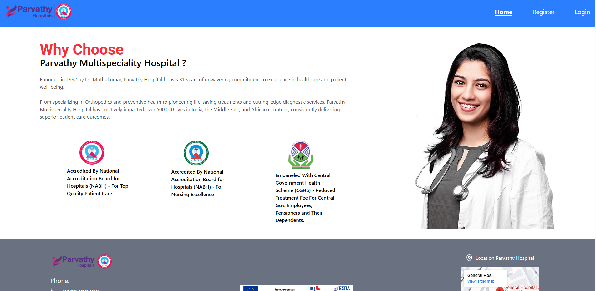

### 🔐 Register Page
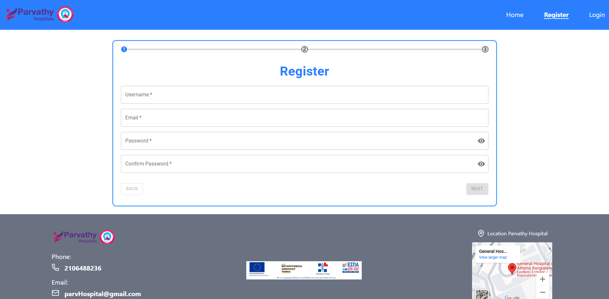

### 🔐 Login Page
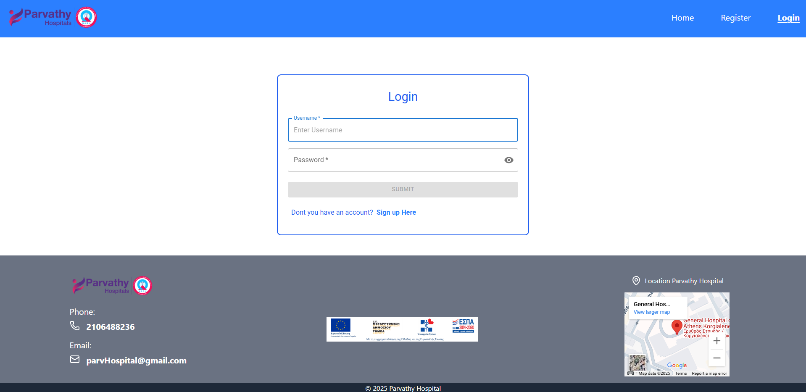

### 🔐 About Page
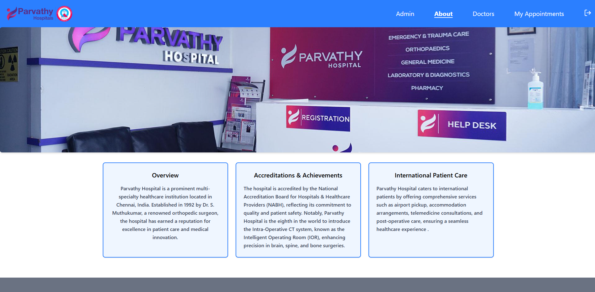

### 🔐 Welcome Page
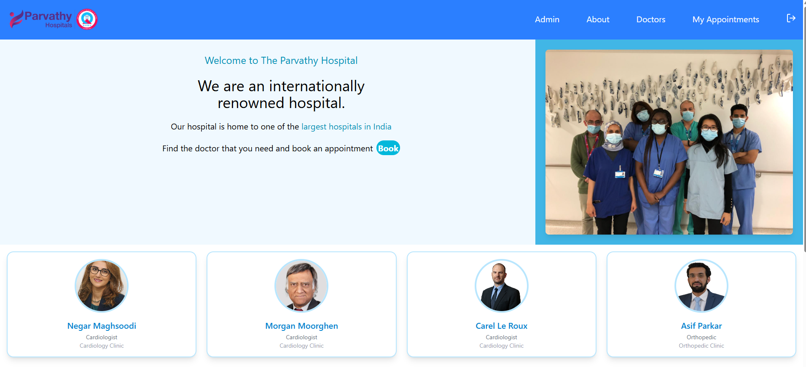

### 📅 Book Appointments
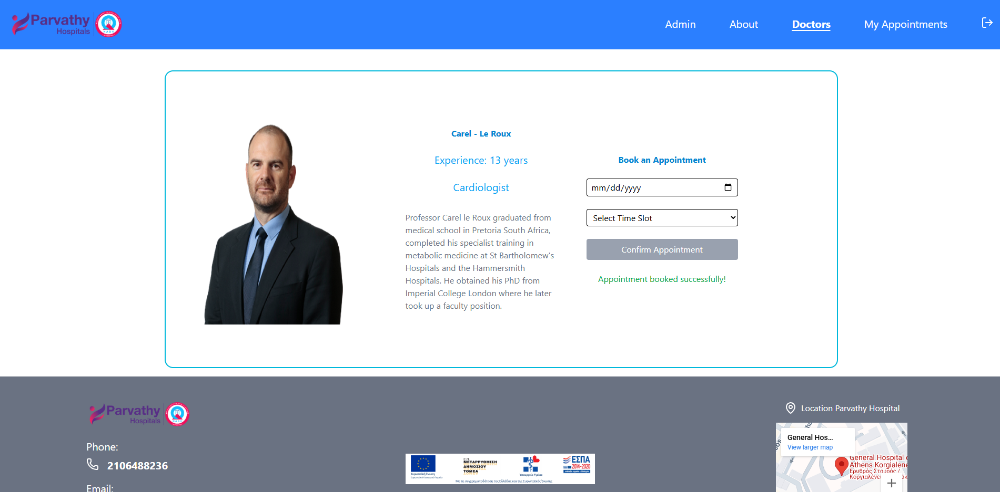

### 🏠 Admin Dashboard
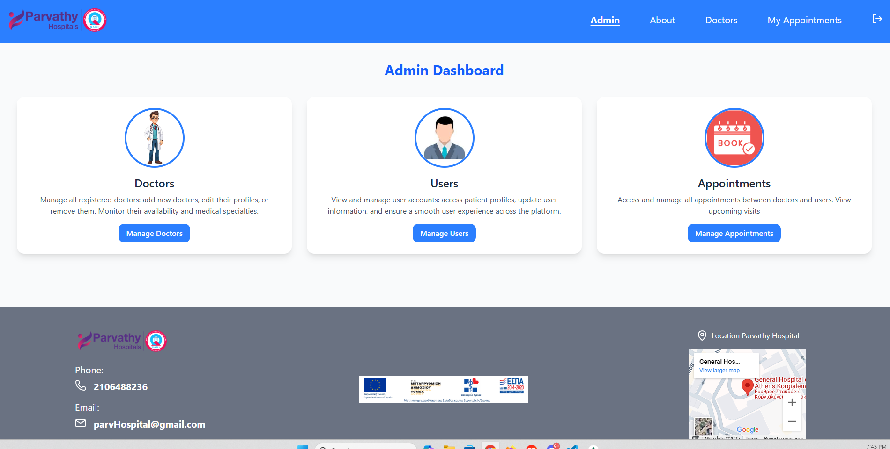

### 🧑‍⚕️ Doctors Page
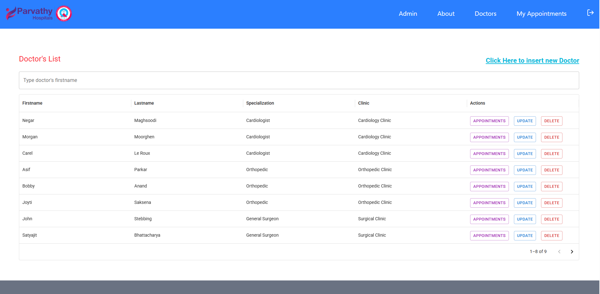

### 🧑‍⚕️ Doctors Appointments Page
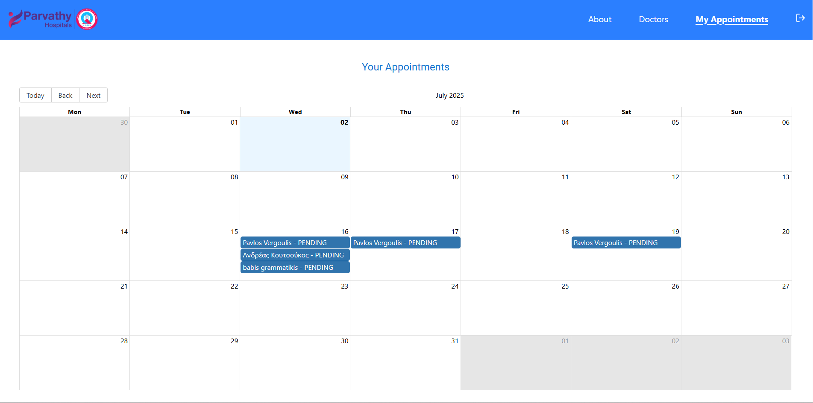

### 🧑‍⚕️ Doctors Create Page
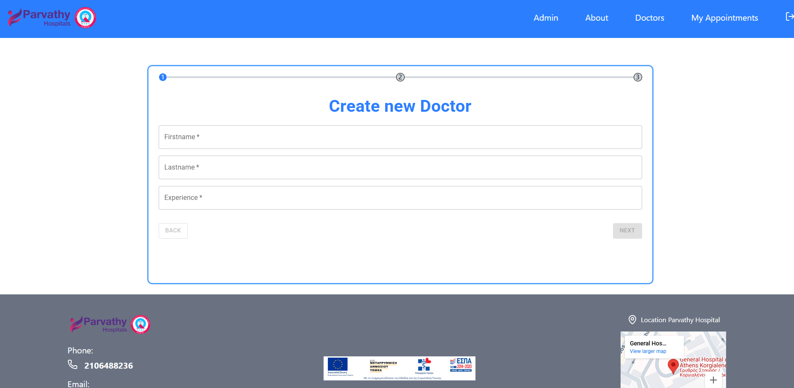

### 📅 My Appointments
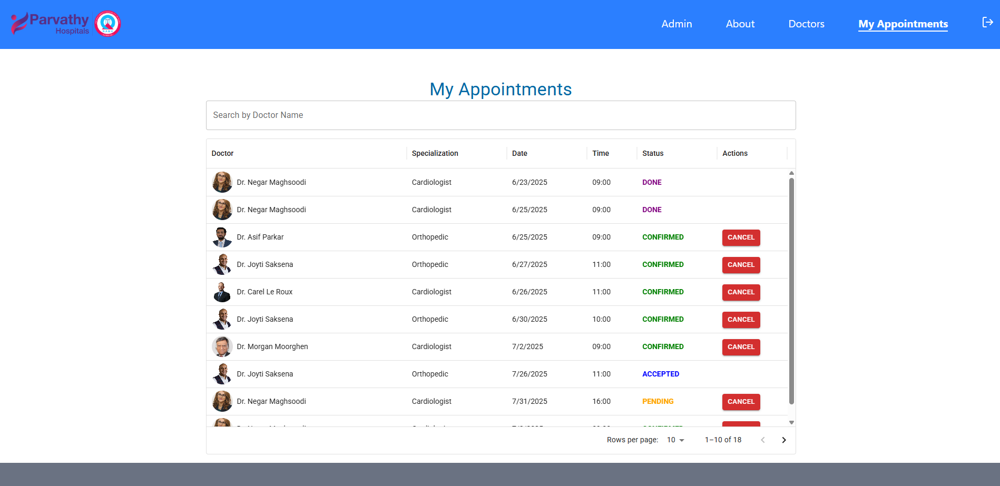

### 📅 Admin Appointments
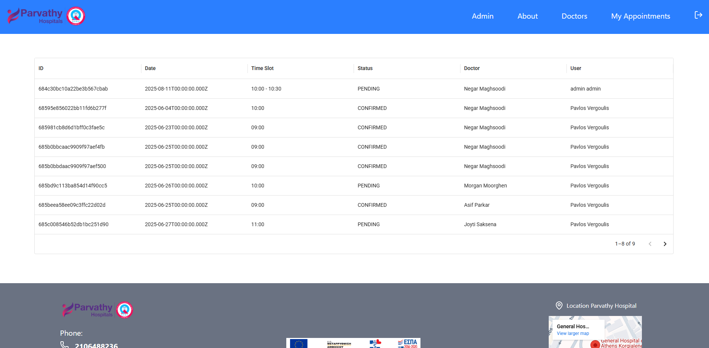

### 🧑 Admin User Page
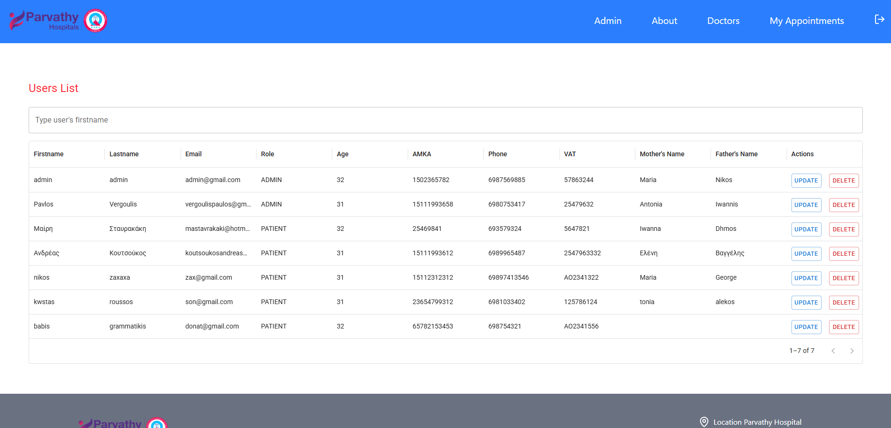

### 🧑 Admin Update User Page
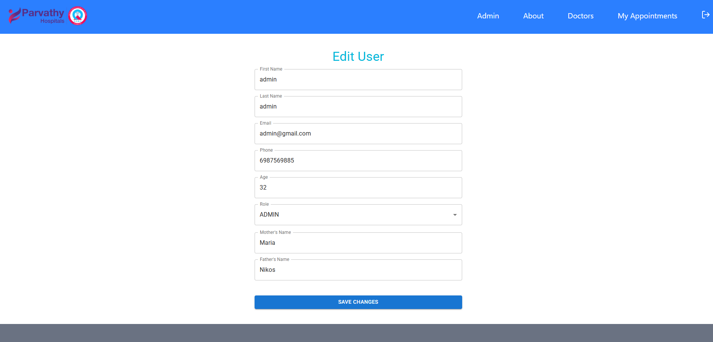